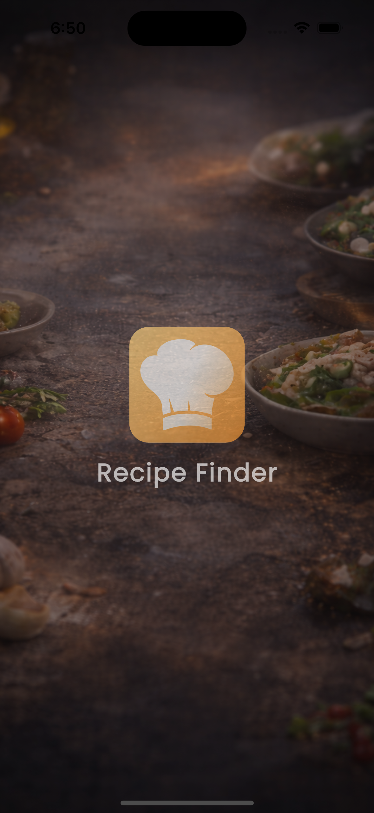
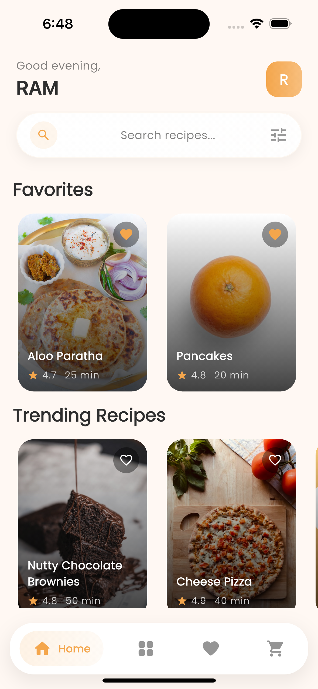
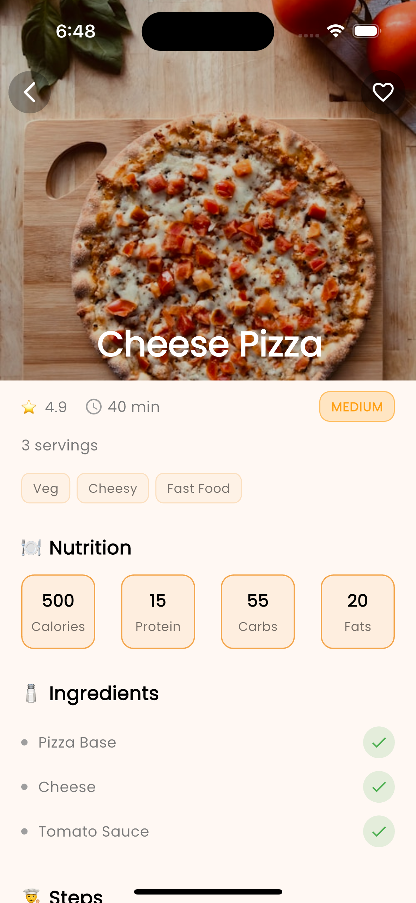
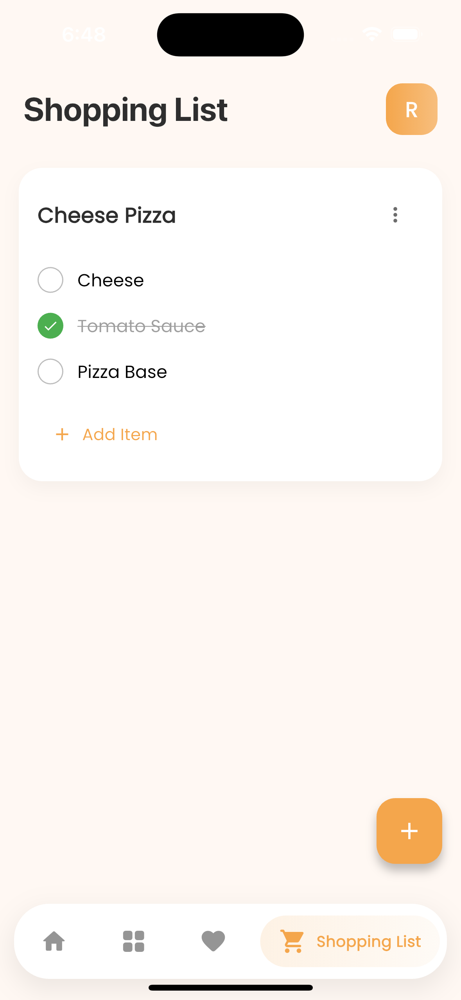

# 🍲 Recipe App – Flutter Application

A modern recipe application built with Flutter that makes cooking simple, personalized, and efficient.
Users can explore recipes, save favorites, and generate smart shopping lists with ease.

This project demonstrates clean architecture using BLoC, local data persistence, voice search integration, and smooth UI animations.

## 🎯 Functionality

- Browse and search recipes
- Save recipes to favorites
- Create and manage shopping lists
- Generate shopping lists directly from recipes
- Edit and update shopping items anytime
- Voice-based recipe search

## 📸 Screenshots
| Splash | Home | Recipe Details | Shopping List |
|------------|----------|-----------|-----------|
 |  |  | 

## 🚀 Features

- Built using Flutter
- BLoC State Management for scalable architecture
- Speech-to-Text Integration for voice search
- Lottie Animations for enhanced UI
- SharedPreferences for fast local storage
- Smooth and responsive UI
- Optimized for performance

## 🛠️ Tech Stack

- **Flutter**
- **Dart**
- **BLoC**
- **Speech-to-Text**
- **Lottie**
- **SharedPreferences**